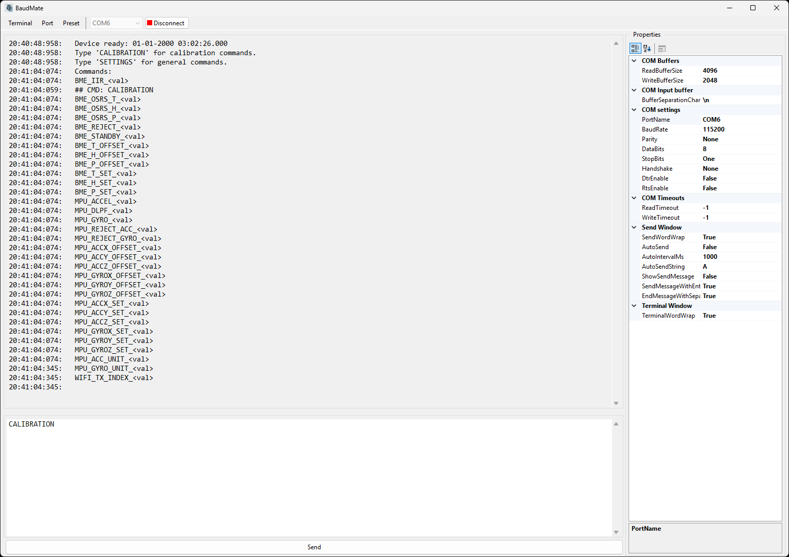

# BaudMate

**Author:** Mathias Gyldenberg (https://github.com/MathiasGyldenberg)
**License:** GNU General Public License v3.0 (GPLv3)  
**Disclaimer:**  
BaudMate is provided as open source software under the GPLv3 license. It is distributed in the hope that it will be useful, but WITHOUT ANY WARRANTY; without even the implied warranty of MERCHANTABILITY or FITNESS FOR A PARTICULAR PURPOSE. All modifications and derivative works must also remain open source under the same license.

---

BaudMate is a modern Windows terminal application for serial (COM) port communication, built with C# 13 and targeting .NET 9. It provides a robust interface for sending, receiving, and managing serial data, with advanced features for automation, buffering, and session management.

## Features

- **Serial Port Communication:** Connect to and communicate with any available COM port.
- **Terminal Window:** View incoming and outgoing messages with optional timestamps, raw input display, and response time calculation.
- **Send Window:** Send messages manually or automatically at configurable intervals. Supports sending on Enter key press and appending separation characters.
- **Presets:** Save and load complete serial port configurations and UI settings as `.bmft` files.
- **Buffer Management:** Activate receive buffer, discard buffers, and customize buffer separation characters.
- **Session Management:** Save terminal window contents, take snapshots, and clear sessions.
- **Property Grid:** Edit serial port and UI properties directly from the application.
- **Power Management:** Prevents system sleep while connected.

## Installation

1. **Requirements:**
   - Windows 10/11
   - [.NET 9 Runtime](https://dotnet.microsoft.com/download/dotnet/9.0)
2. **Build:**
   - Open the solution in Visual Studio 2022.
   - Build the project (`Ctrl+Shift+B`).
   - Run (`F5`) or publish using Visual Studio’s __Publish__ feature.

   - Alternatively, download the latest release .exe from the [GitHub Releases] page.

## Usage

1. Launch BaudMate.
2. Select a COM port from the dropdown.
3. Click **Connect** to open the port.
4. Use the send window to transmit messages.
5. View responses in the terminal window.
6. Save/load presets for quick configuration.
7. Use menu options for buffer management, snapshots, and saving logs.

## File Formats

- **Presets:** Saved as `.bmft` (XML format).
- **Terminal Logs:** Saved as `.txt`.

## Contributing

Pull requests and issues are welcome! Please ensure code style matches the project and all contributions are tested.

## License

This project is licensed under the GPLv3 License. See the [LICENSE](LICENSE) file for details.

## Acknowledgements

- Built with .NET 9 and C# 13.
- Uses Windows Forms and System.IO.Ports.

---

*For questions or support, open an issue on GitHub.*